# feature-workflow — 큰 작업을 끝까지 끌고 가는 워크플로우 + 무인 하네스

> "세션이 끊겨도, 자리를 비워도, 작업은 같은 규칙으로 끝까지 간다."

`feature-workflow` 는 **여러 세션·여러 날에 걸치는 큰 작업**(마이그레이션·멀티모듈 리팩토링·다단계 피처)을
위한 Claude Code, Codex, OpenCode에서 재사용할 수 있는 플러그인입니다. 두 층으로 이루어져 있습니다.

| 층 | 무엇 | 언제 쓰나 |
|---|---|---|
| **유인 스킬/커맨드** (`/feature-workflow:start` 등) | 사람이 Claude Code 세션을 운전하며 brainstorm → plan → phase 실행 → verify 를 밟는 **규약** | 사람이 옆에 있을 때 |
| **무인 하네스** (`fw` CLI) | 같은 규약을 **모델이 어길 수 없는 코드**로 옮긴 오케스트레이터. 3역할 인터뷰 → phase 순차 실행 → 적대적 검증 → 합의를 사람 없이 돈다 | 밤새 돌리고 아침에 결과를 볼 때 |

두 층은 `docs/<workflow>/` 아래 **PLAN.md · NOTES.md · STATE.json** 3종 문서를 공유하므로,
유인으로 시작해서 무인으로 돌리고 다시 유인으로 이어받는 왕복이 자유롭습니다.

---

## 목차

1. [30초 요약 — 핵심 아이디어 세 가지](#1-30초-요약--핵심-아이디어-세-가지)
2. [전체 그림](#2-전체-그림)
3. [산출물 — 누가 쓰고 누가 읽나](#3-산출물--누가-쓰고-누가-읽나)
4. [라이프사이클 상세](#4-라이프사이클-상세)
   - 4.1 시작 — 두 가지 진입점
   - 4.2 3역할 인터뷰 (`fw interview`)
   - 4.3 실행 — `fw run` 코어 루프
   - 4.4 세션 계약 — 세션이 받는 것과 돌려주는 것
   - 4.5 BLOCKED 왕복 — 물을 사람이 없을 때
   - 4.6 PR 모드 — 리뷰 왕복까지 무인으로
   - 4.7 마무리 — 적대적 3역할 검증 + 합의
5. [상태 전이](#5-상태-전이)
6. [안전장치 — 왜 세션을 믿지 않는가](#6-안전장치--왜-세션을-믿지-않는가)
7. [개발자 사용 설명서](#7-개발자-사용-설명서)
   - 7.1 설치
   - 7.2 시나리오 A — 빠른 시작 (유인 start → 무인 run)
   - 7.3 시나리오 B — 인터뷰부터 (목표 한 문장 → PLAN 자동 조립)
   - 7.4 밤새 돌리기와 아침 루틴
   - 7.5 멈췼을 때 — 상태별 대응표
   - 7.6 PR 모드 켜기
   - 7.7 유인으로 이어받기
8. [레퍼런스](#8-레퍼런스)
   - 8.1 커맨드 (유인)
   - 8.2 `fw` CLI (무인)
   - 8.3 STATE.json 필드
   - 8.4 PLAN.md 작성 규칙 — 파싱되는 절
9. [설계 철학 — 자주 묻는 질문](#9-설계-철학--자주-묻는-질문)
10. [디렉토리 구조와 관련 문서](#10-디렉토리-구조와-관련-문서)

---

## 1. 30초 요약 — 핵심 아이디어 세 가지

**① 시작과 끝은 사람, 가운데는 기계.**
목표를 쓰는 것, 인터뷰 질문에 답하는 것, PLAN 을 승인하는 것, PR 을 머지하는 것, 최종 "됐다"를
판정하는 것은 사람만 합니다. 하네스는 그 사이의 무인 구간(질문 생성·코드 작성·검증·재시도)만
자동화하며, **결정을 만들지 않고 운반만** 합니다.

**② 세션의 "끝났다"를 믿지 않는다.**
무인 세션이 `done` 을 보고해도 하네스가 검증 명령을 **직접 실행해 exit code 로 판정**합니다.
커밋 SHA 가 실제로 존재하고 세션 시작 이후에 생겼는지, 격리 브랜치에서 도달 가능한지, 검증
스크립트 자체를 고치지 않았는지까지 기계적으로 확인합니다.

**③ 같은 세 역할이 두 번 등장한다.**
기획·개발·평가 세 "고수"가 시작 시점에 **인터뷰**로 계획을 만들고, 끝 시점에 같은 세 역할이
**적대적 검증**으로 그 계획이 지켜졌는지 반증을 찾습니다. 인터뷰 산출물이 그대로 검증 체크리스트가
됩니다.

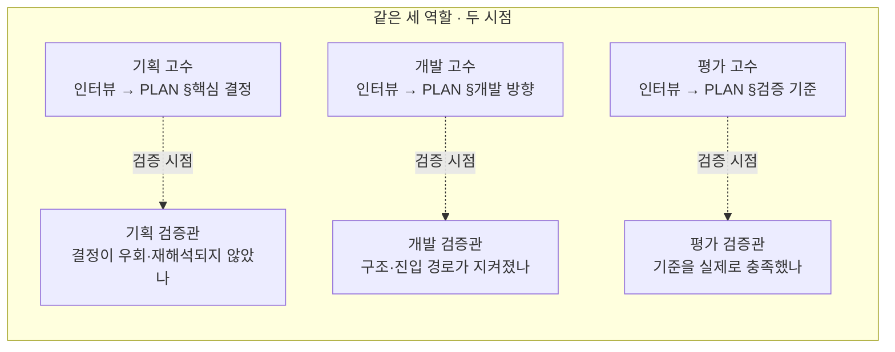

---

## 2. 전체 그림

사람이 관여하는 지점(👤)과 하네스가 혼자 도는 구간(🤖)을 한 장에 그리면 다음과 같습니다.

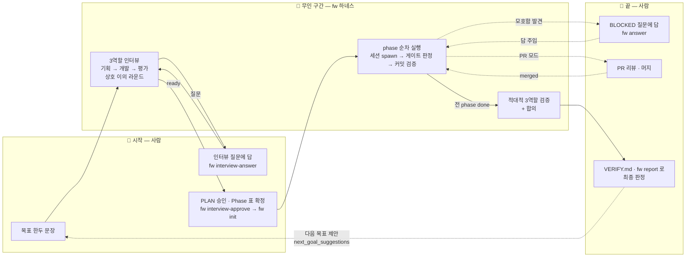

한 사이클에서 사람이 하는 일은 세 지점뿐입니다:

| 단계 | 하네스가 하는 일 | 사람이 하는 일 |
|---|---|---|
| 인터뷰 | 세 역할이 질문·초안·상호 이의 라운드를 반복 | 질문에 답하기, 승인(`--force` 포함) |
| 실행 | phase 별 세션 실행 · 게이트 판정 · 재시도 | 없음 (BLOCKED 질문이 오면 답하기) |
| 검증 + 합의 | 3역할 적대 검증 + 합의문 작성 | VERIFY.md 읽고 최종 판정 |

비용은 세션마다 STATE.json 에 기록되고 `max_cost_usd` 로 상한을 걸 수 있습니다. 실제 금액은 모델·리포·재시도
횟수에 따라 크게 달라지므로 여기에는 적지 않습니다 — 본인 환경에서 `fw report` 로 직접 재는 것이 정확합니다.

---

## 3. 산출물 — 누가 쓰고 누가 읽나

워크플로우 하나는 `docs/<workflow>/` 디렉토리 하나입니다. 유인·무인 어느 모드든 **3종 문서는
항상 존재**하고, `fw interview` / `fw verify` 를 실행하면 2종이 더 생깁니다(유인 모드에서도 두 명령은 쓸 수 있습니다).

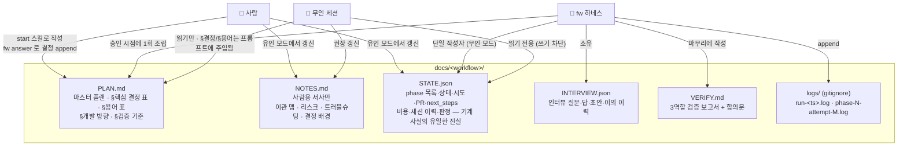

| 파일 | 담는 것 | 담지 않는 것 | 작성자 |
|---|---|---|---|
| `PLAN.md` | 변하지 않는 마스터 플랜. **§핵심 결정 사항 표**(ID·결정·근거·상태·날짜), **§용어 표**, §개발 방향, §검증 기준, Phase 표 | 진행 상태 | 사람(유인) / `fw interview-approve` 가 초안 조립 / `fw answer` 가 결정 행 append. **무인 주행 중에는 동결** — 세션이 쓸 수 없음 |
| `NOTES.md` | 사람용 서사 — 이관 맵, 리스크, 트러블슈팅, "왜 이렇게 했나" | phase 상태 표 (그건 `fw status` 로 본다) | 사람 또는 세션 |
| `STATE.json` | phase 목록·상태·시도 횟수·`next_steps`·PR 번호·세션 이력·비용·하네스 판정·BLOCKED 질문과 답 | 서사 | **유인**: 세션이 직접 갱신 / **무인**: 하네스만 (세션은 읽기 전용) |
| `INTERVIEW.json` | 3역할 인터뷰의 질문(P1/D1/E1…)·답·역할별 초안·이의 이력·세션 수·비용 | — | `fw interview` (하네스) |
| `VERIFY.md` | 역할별 적대 검증 보고서 + 합의(합의된 완료·문제·이견·다음 목표) | — | `fw run` 마무리 · `fw verify` (하네스) |

**PLAN 의 Phase 표와 STATE 의 `phases` 는 항상 같은 목록**(제목·개수·순서)이어야 합니다. STATE 는
거기에 상태·시도·next_steps 를 얹을 뿐입니다.

**INTERVIEW.json 과 VERIFY.md 가 3종에 합쳐지지 않고 따로인 이유**는 수명과 덮어쓰기 규칙이 다르기
때문입니다. INTERVIEW.json 은 PLAN·STATE 가 아직 없는 시점에 만들어지고 승인 뒤에는 감사 기록으로만
남습니다(Q&A 는 PLAN §핵심 결정 행으로, 미해소 이의는 PLAN "미검증 승인" 절로 이미 옮겨짐). VERIFY.md 는
`fw verify` 를 돌릴 때마다 통째로 재생성되는 기계 출력이라, 사람 서사인 NOTES 나 주행 중 동결되는 PLAN 에
넣으면 그 문서들의 규칙이 깨집니다. 유인 모드에서 같은 일을 할 때는 `/start` 가 인터뷰 결과를 PLAN 결정
표에, `/review`·`/verify` 가 검토 결과를 NOTES 에 직접 적습니다 — 두 파일이 없는 것이 아니라 내용이
3종 안에 들어가는 것입니다.

---

## 4. 라이프사이클 상세

### 4.1 시작 — 두 가지 진입점

| 진입점 | 방식 | 어울리는 상황 |
|---|---|---|
| **A. `/feature-workflow:start <이름>`** | AI assistant 세션에서 사람이 brainstorm. 브랜치 위치 합의 → 목표·모호점 질문(추천 답안 동봉) → 3종 문서 생성 | 사람이 옆에 있고, 목표가 어느 정도 선명할 때. 빠르다 |
| **B. `fw interview <이름> --goal "..."`** | 기획·개발·평가 세 에이전트가 각자 관점에서 **끝까지 캐묻고**, 서로의 초안에 이의를 걸어 수렴시킨 뒤 PLAN 초안을 자동 조립 | 목표만 있고 계획이 없을 때. 인터뷰 종료 조건이 기계적이라 "이 정도면 충분" 이라는 모델의 자기 주장으로 끝나지 않는다 |

두 진입점은 결과물이 같습니다(`docs/<이름>/PLAN.md` + `STATE.json` + `NOTES.md`). B 는
PLAN 의 Phase 표를 자리표시자로 남기므로 사람이 채운 뒤 `fw init` 으로 STATE 를 만듭니다.

`/start` 가 하는 일을 조금 더 풀면:

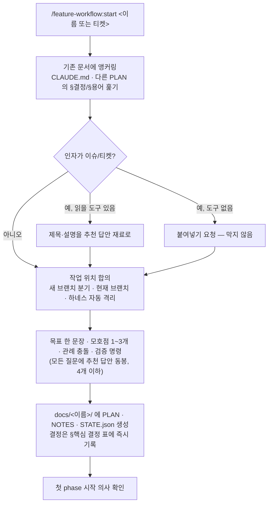

브랜치를 새로 만들 때는 `git fetch origin <base>` 후 `origin/<base>` 기준으로 `--no-track` 분기하며,
이름은 **`feature/<작업 이름>`** 으로 작업 이름(= docs 디렉토리명 = STATE `workflow`)과 정확히
같은 문자열을 씁니다. prefix·base 는 리포 관례를 감지해 추천만 하고 강제하지 않습니다.

### 4.2 3역할 인터뷰 (`fw interview`)

인터뷰의 핵심은 **종료 조건을 기계가 갖는다**는 점입니다.

> 미답 질문 0건 **AND** 역할별 초안 3개 **AND** 상호 이의 0건 → `ready` → 사람이 승인

어느 하나도 모델의 "충분한 것 같습니다" 로 채울 수 없습니다. 전부 셀 수 있는 값입니다.

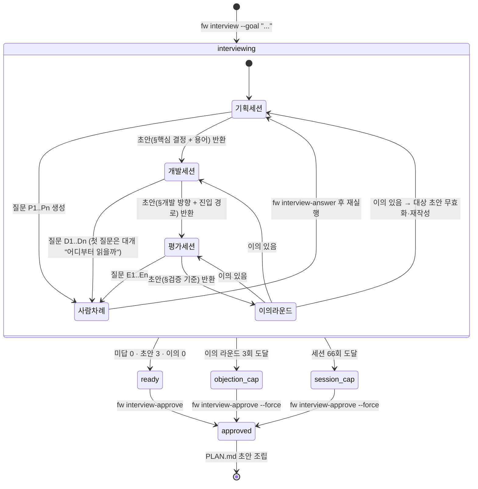

몇 가지 설계 포인트:

- **역할 순서는 고정** — 기획 → 개발 → 평가. 뒤 역할은 앞 역할의 Q&A 와 초안을 컨텍스트로 받습니다.
- **질문이 하나라도 있으면 초안은 무시** — "물을 게 남았는데 초안도 썼다" 는 답을 안 듣고 결정했다는 뜻이므로 보수적으로 질문 쪽을 택합니다.
- **사람 차례가 최우선** — 미답 질문이 있으면 에이전트를 더 돌리지 않습니다. 답 없이 쓴 초안은 나중에 답과 충돌합니다.
- **진입 경로는 개발 고수의 산출물** — "코드를 어디부터 읽어야 하나" 자체가 첫 질문이 됩니다. 전체 스캔은 금지입니다(토큰 낭비이면서 중요한 곳을 놓침). `--entry` 로 미리 줄 수도 있습니다.
- **용어는 기획 고수의 산출물** — 초안과 함께 glossary 를 반환하고, 이것이 PLAN §용어 표가 되어 모든 무인 세션에 주입됩니다.
- **이의 라운드는 적대적 검증을 앞당긴 것** — 각 역할이 다른 두 역할의 초안에 이의를 걸고, 이의를 받은 초안은 무효화되어 재작성됩니다. 이의의 `from_role` 은 세션 출력이 아니라 하네스가 스탬프합니다(사칭 차단).
- **상한은 실패가 아니라 "사람이 판단하라"** — 이의 라운드 3회, 총 세션 66회에 도달하면 `--force` 승인이 열립니다. 미해소 이의는 PLAN 의 "미검증 승인" 절에 그대로 실려 검증 단계가 대조합니다.
- **인터뷰 Q&A 는 곧 결정** — 승인 시 답변 하나가 §핵심 결정 표의 행 하나(`P3 | 질문 → 답 | 인터뷰(기획) | accepted | 날짜`)로 변환됩니다.

승인 후 조립되는 PLAN.md 의 골격:

```
# <목표 요약>
**Goal:** ...
## 진입 경로
## PR/Phase 단위 작업 순서      ← 사람이 채운다 (자리표시자)
## 핵심 결정 사항               ← Q&A 행 + 기획 초안
## 개발 방향                    ← 개발 초안 (진입 경로·구조·phase 분할 제안)
## 검증 기준                    ← 평가 초안 (exit code 로 확인 가능한 항목)
## 미검증 승인 (--force 일 때만)
## 용어                         ← 기획 glossary
```

### 4.3 실행 — `fw run` 코어 루프

`fw run docs/<workflow>` 한 번이면 STATE.json 의 pending phase 를 의존성 순서대로 끝까지 돕니다.

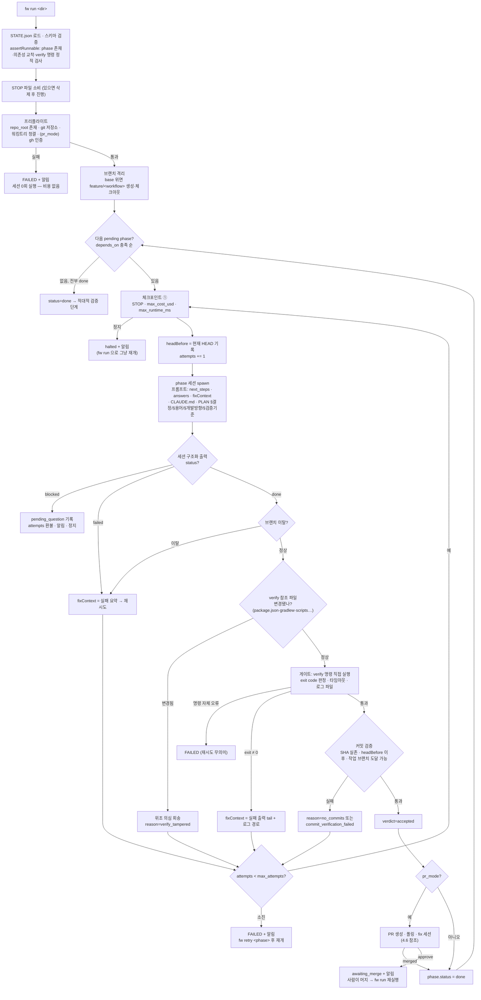

루프의 몇 가지 성질:

- **재시도는 컨텍스트를 들고 간다** — 게이트 실패 출력의 마지막 4000자와 전체 로그 경로가 다음 세션 프롬프트의 `fixContext` 로 들어갑니다. 위조 의심·커밋 없음·브랜치 이탈도 각각 정확한 사유가 전달됩니다.
- **BLOCKED 는 실패가 아니다** — attempt 를 환불하고 질문을 표면화합니다. 사람이 답하면 그 답이 이후 모든 세션 프롬프트에 주입됩니다.
- **판정은 STATE 에 남는다** — 각 세션에 하네스의 verdict(`accepted` / `bounced`+reason / `session_failed` / `session_blocked`)가 기록되어 `fw report` 가 회송 사유 분포를 보여줍니다.
- **체크포인트는 "새 걸음 떼기 직전"에만** — 돌고 있는 세션을 중간에 죽이면 커밋이 반쯤 된 상태가 남기 때문에, STOP·비용·시간 상한은 새 세션을 띄우기 직전과 PR 폴링 sleep 직후에만 검사합니다.
- **절전 방지 내장** — macOS 에서 `caffeinate` 를 함께 띄워 밤새 잠들지 않게 합니다.
- **스트림 무활동 타임아웃** — 세션이 20분간 메시지를 보내지 않으면 실패 처리 후 재시도 루프에 태웁니다(VPN 단절로 16시간 무한 대기하던 클래스를 막음).

### 4.4 세션 계약 — 세션이 받는 것과 돌려주는 것

무인 세션은 Claude Agent SDK 의 `query()` 로 띄우며, **구조화 출력을 SDK 레벨에서 강제**하고
하네스가 zod 로 다시 검증합니다.

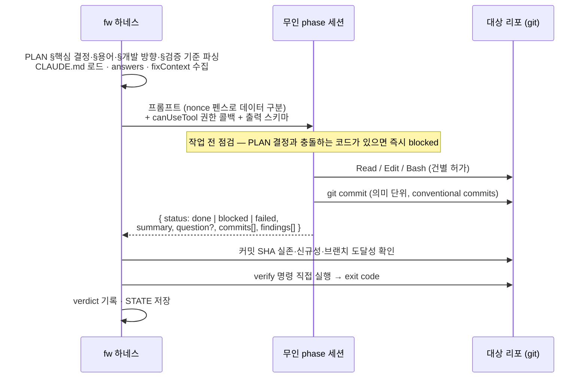

세션에게 **주는 것**:

| 항목 | 출처 | 비고 |
|---|---|---|
| 이 phase 의 작업 단계 | `STATE.phases[].next_steps` | 다음 세션이 컨텍스트 0 으로 이어받는 유일한 자리 |
| 사람의 답변들 | `STATE.answers` | BLOCKED 왕복으로 쌓인 것 전부 |
| 직전 실패 컨텍스트 | 게이트 출력 tail·회송 사유 | 재시도일 때만 |
| 리포 관례 | `<repo>/CLAUDE.md` | 8000자 캡. 세션은 이 파일을 쓸 수 없음(옵트아웃 가능) |
| 결정·용어·개발 방향·검증 기준 | `PLAN.md` 의 해당 절 | **표로 써야 파싱됨**. "PLAN 을 읽어라"는 요청이지만 주입은 집행 |

세션이 **돌려주는 것**:

| 필드 | 뜻 |
|---|---|
| `status: "done"` | 커밋했고 끝났다고 주장 — 하네스가 검증 |
| `status: "blocked"` + `question` | 모호함·결정 충돌 발견. **절충하지 않고 멈춤** |
| `status: "failed"` + `summary` | 스스로 실패 인정 |
| `commits[]` | 이번 세션이 만든 커밋 SHA |
| `findings[]` | **범위 밖 발견** — `bug` / `learned` / `needed` / `plan_change`. 멈추지 않고 적어둔다. PLAN 은 직접 고치지 않고 제안만 |

`blocked`(멈춤)와 `findings`(계속)의 구분이 중요합니다. 목표를 끝내는 데 결정이 필요하면
blocked, 목표는 끝낼 수 있는데 따로 알릴 게 있으면 findings 입니다. `fw report` 가 findings 를
모아 보여주므로 밤새 세션이 발견한 버그·기획 수정 제안을 아침에 한 번에 봅니다.

### 4.5 BLOCKED 왕복 — 물을 사람이 없을 때

유인 모드의 "불확실하면 묻는다"는 무인 모드에서 "묻는 대신 `blocked` 로 반환하고 종료"로
치환됩니다. 임의 결정·절충 진행은 두 모드 모두 금지입니다.

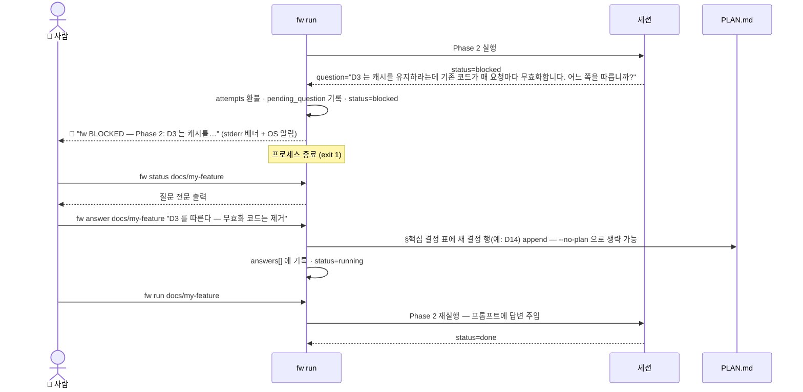

답변은 STATE 에만 남는 게 아니라 **PLAN §핵심 결정 표에도 자동으로 append** 됩니다. 채팅에서
한 결정이 문서 밖으로 새지 않게 하기 위함이며, 이후 모든 세션이 그 결정을 프롬프트로 받습니다.

### 4.6 PR 모드 — 리뷰 왕복까지 무인으로

STATE 에 `"pr_mode": true, "allow_push": true` 를 넣으면 phase 게이트 통과 후 PR 을 만들고
리뷰 코멘트를 반영하는 왕복을 자율로 돕니다. **머지는 사람만** 합니다.

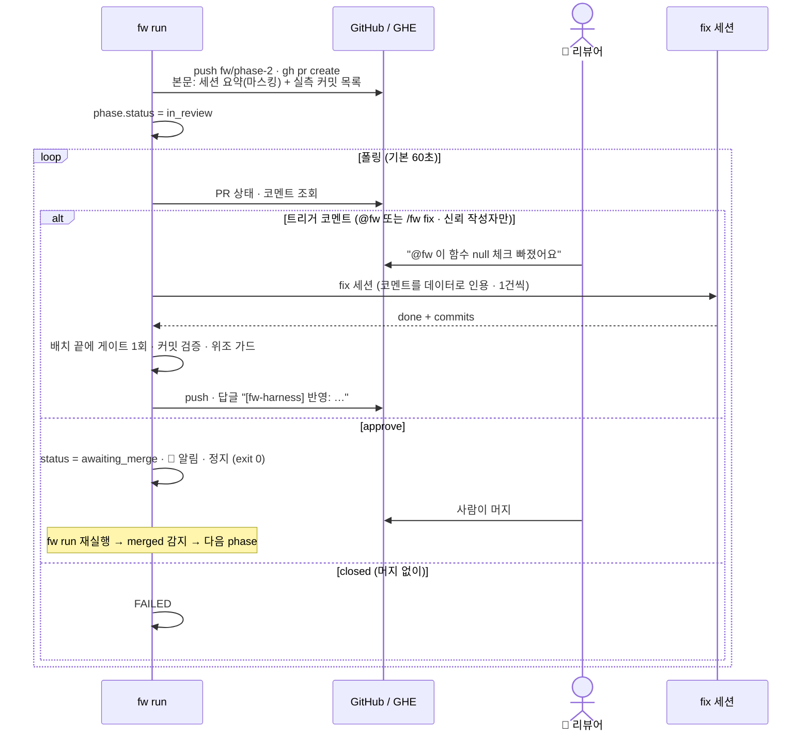

신뢰 경계 규칙:

- **마커가 있는 코멘트만 읽는다** — `@fw` / `/fw fix`(대소문자 무시). 코드블록·인용문·HTML 주석·`<details>` 안의 마커는 예시로 보고 무시합니다.
- **작성자 allowlist 는 fail-closed** — `trusted_comment_authors` 에 없는 사람의 트리거는 무시됩니다. 기본 모드(`"trusted"`)에서 이 배열이 비어 있으면 `fw run` 이 **시작을 거부**합니다(밤새 아무 일도 안 일어나는 무음 무력화 방지). PR 만 만들고 코멘트는 안 읽겠다면 `"pr_comment_mode": "off"` 로 명시합니다.
- **하네스는 머지할 수 없다** — `gh pr merge`/`close`/`reopen`, `gh api` 쓰기 메서드·GraphQL mutation·`/merge` 경로가 권한 정책에서 차단됩니다.
- **fix 세션 상한** — PR 당 `max_fix_sessions`(기본 10). 초과 시 FAILED 로 정지해 유료 세션이 무한히 붙지 않게 합니다.
- **squash 머지 대응** — 머지 후 다음 phase 가 있으면 작업 브랜치를 갱신된 base 위로 재생성해 phase 간 diff 누적을 끊습니다.

#### 조각 PR — 큰 phase 를 리뷰 가능한 크기로 나눈다

phase 하나가 곧 PR 하나이면 **PR 이 리뷰할 수 없을 만큼 커집니다.** 실측: 이 리포의 `tamper-gap` 워크플로우 머지는 15 files / +1934 였고, 그중 워크플로우 문서 기록이 단독 +1061 이었습니다 — 부피의 절반 이상이 리뷰 대상이 아닌 인수인계 기록이었습니다.

`review_split` 을 켜면 phase 를 실행하기 **전에** 읽기 전용 세션이 그 phase 를 조각으로 나누고, 조각마다 PR 을 냅니다. 조각 PR 은 base 브랜치가 아니라 **통합 브랜치**로 갑니다.

```
<통합브랜치>-1 ──┐
<통합브랜치>-2 ──┼──▶  <통합 브랜치>  ──▶  <base 브랜치>
<통합브랜치>-3 ──┘      (조각 누적)      (마지막에 통합 PR 1회)
```

이 토폴로지가 중요한 이유: base 브랜치가 중간 상태를 볼 일이 없으므로 **조각이 그 자체로 완결일 필요가 없습니다.** "인터페이스만 추가 / 구현 / 호출부 교체" 처럼 자연스럽게 나눌 수 있고, 억지로 완결 단위를 만들려다 조각이 커지는 일이 없습니다.

**켜는 방법 — `/feature-workflow:start` 가 물어봅니다.** 인터뷰 끝에 위 그림을 보여주며 "PR 을 잘게 나눌까요?" 를 묻고, 작업 규모를 보고 추천까지 붙입니다. 직접 켜려면 STATE.json 에:

```json
{ "pr_mode": true, "allow_push": true,
  "review_split": { "enabled": true, "budget_lines": 400 } }
```

- `budget_lines` 는 **목표치이고 상한이 아닙니다.** 분해 세션에 주는 기준일 뿐이고, 넘어도 진행을 막지 않습니다. 넘으면 **실행 로그**에 남습니다(PR 본문이 아닙니다 — 리뷰어가 아니라 운영자에게 필요한 신호입니다).
- 조각 하나의 목표 라인 수는 **코드+테스트**로 셉니다 — 워크플로우 문서(`docs/<workflow>/`)는 제외합니다.

**PR 본문에는 리뷰어가 읽을 것만 담습니다.** 세 가지뿐입니다 — 이 PR 이 어디로 머지되는지 한 줄, 세션이 쓴 설명, 읽는 순서를 어디서 보는지.

세션이 쓰는 설명은 "무엇을 하는 변경인가 → 왜 필요한가 → 알아둘 것" 순서의 평문입니다. 테스트 개수·통과 여부·커밋 확인 같은 진행 보고, 코드 조각, 파일 목록은 쓰지 않도록 프롬프트가 막습니다 — 자기 작업을 보고하는 글이 아니라 남이 이 변경을 이해하게 돕는 글이어야 하기 때문입니다. 세션이 쓴 텍스트는 전부 마스킹을 거쳐 나갑니다.

본문에 **없는** 것과 그 이유:

| 뺀 것 | 어디에 있는가 |
|---|---|
| 커밋 목록, 파일별 증감 | GitHub 의 **Commits / Files changed** 탭 — 본문에 다시 적으면 중복입니다 |
| 조각 분해 근거 | STATE(`split_rationale`), `fw doctor` |
| 예산 대비 실측 | 실행 로그 — 리뷰어가 아니라 운영자에게 필요한 신호입니다 |
| 통과한 검증 명령 | 실행 로그, STATE |

**읽는 순서는 코드 위에 붙습니다.** 어떤 파일을 왜 봐야 하는지는 Files changed 의 그 파일 변경 지점에 인라인 코멘트로 달립니다 — 안내가 코드에서 떨어져 있으면 리뷰어가 줄을 직접 찾아야 하기 때문입니다. 첫 항목에는 "여기부터 읽으세요"가 붙고, 순서는 각 코멘트의 `N/M` 이 알려줍니다. 본문에는 같은 글을 다시 적지 않습니다.

몇 번째 줄에 붙일지는 **하네스가 diff 를 읽어 정합니다**. 세션이 "193번째 줄 근처"처럼 말한 값은 쓰지 않습니다 — 검증할 수 없는 추측이고, GitHub 은 diff 밖의 줄을 거부하면서 **그 리뷰의 코멘트 전체를 함께 거부**합니다(실측). 줄을 추가한 첫 지점에 붙이고, 삭제만 있는 파일은 삭제된 줄에 붙입니다. 붙일 곳이 없는 파일(바이너리, 세션이 지목했지만 변경되지 않은 파일)은 그 항목만 본문에 이유까지 남습니다. 인라인 붙이기가 실패하면 전문을 일반 코멘트로 대신 남기므로 어느 경로로도 정보가 사라지지 않습니다.

제약과 안전장치:

- **`pr_mode` 가 필요합니다.** 조각은 통합 브랜치로 머지되어야 그 브랜치가 전진하고 다음 조각이 그 위에서 시작합니다. `pr_mode` 없이 켜면 `fw run` 이 시작을 거부합니다.
- **`branch_strategy: "current"` 와 함께 쓸 수 없습니다.** 조각 브랜치를 하네스가 만들어야 하는데 `current` 는 브랜치를 사용자에게 위임하는 전략입니다. 이 조합도 시작 시점에 거부합니다.
- **조각 브랜치를 파괴적으로 만들지 않습니다.** 이름이 이미 쓰이고 있으면 그 브랜치가 통합 브랜치 위에 얹혀 있는지(= 우리가 만든 것인지) 확인하고, 확인되지 않으면 덮지 않고 멈춥니다.
- **머지 후 통합 브랜치 전진은 강제 없는 fast-forward** 입니다. 하네스가 통합 브랜치에 직접 커밋하지 않으므로 squash 머지에서도 fast-forward 가 성립하고, 아니면 git 이 스스로 거부해 로컬 커밋을 잃지 않습니다.
- **분해가 실패해도 주행은 계속됩니다.** 세션 실패·검증 거부·"쪼갤 필요 없음" 은 모두 원본 phase 를 그대로 실행하는 것으로 수렴하고, 그 이유가 STATE 와 `fw doctor` 에 남습니다. 자동 재분해는 하지 않습니다.

끄면(`enabled: false` 또는 미설정) 주행 동작이 기존과 동일합니다. 현황은 `fw doctor` 의 `[조각 분해]` 절에서 봅니다.

### 4.7 마무리 — 적대적 3역할 검증 + 합의

전 phase 가 `done` 이 되면 하네스는 인터뷰와 같은 세 역할을 **검증관**으로 다시 띄웁니다.
임무는 "통과를 확인하라"가 아니라 **"반증을 찾아라"** 입니다.

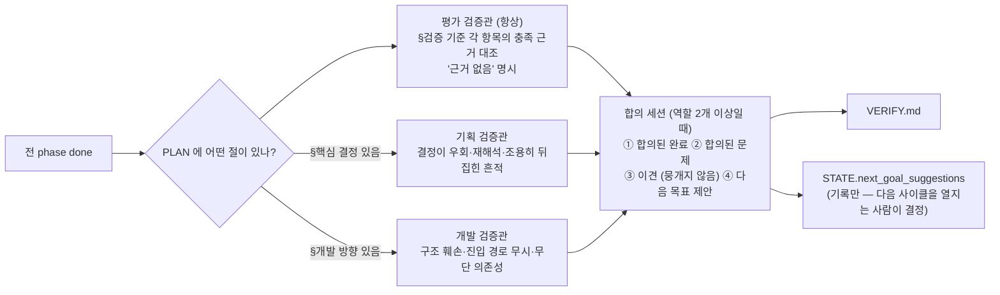

- 검증관은 **읽기 전용**이며 파일을 고치지 않습니다.
- 비용 상한(`max_cost_usd`)에 닿으면 남은 역할을 생략하되, **생략했다는 사실을 VERIFY.md 에 명시**합니다(조용한 생략은 "전부 검증했다"로 읽힘).
- 검증 보고서는 부산물 — 실패해도 `done` 판정을 막지 않습니다. 대신 `fw verify <dir> --budget 10` 으로 완주한 워크플로우에 사후 검증만 다시 돌릴 수 있습니다.
- 합의 출력이 무의미하게 퇴화하면(예: "a", "b") 스키마를 통과했어도 1회 재시도합니다.

---

## 5. 상태 전이

워크플로우 전체 상태(`STATE.status`)와 phase 상태(`phases[].status`)는 별개입니다.

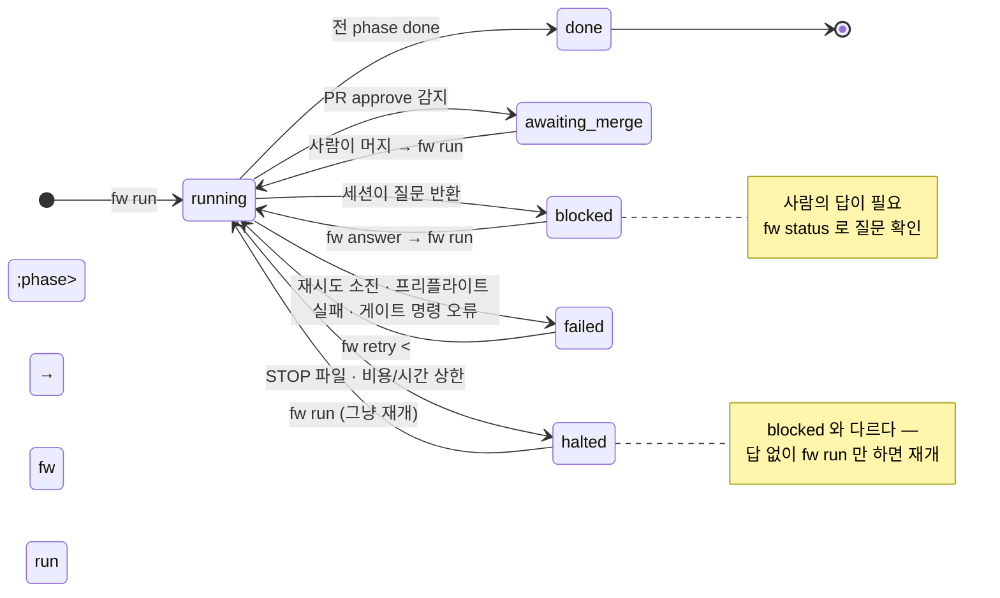

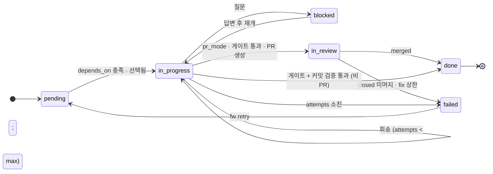

| `STATE.status` | 뜻 | 사람이 할 일 | `fw run` 종료 코드 |
|---|---|---|---|
| `running` | 진행 중 (또는 중단된 채 저장됨) | 없음 / 재개 | — |
| `blocked` | 세션의 질문 대기 | `fw status` → `fw answer` → `fw run` | 1 |
| `awaiting_merge` | PR approve 됨 | PR 머지 → `fw run` | 0 |
| `halted` | STOP·상한으로 정지 | 필요하면 상한 조정 → `fw run` | 0 |
| `failed` | 재시도 소진·치명 오류 | `fw log` 로 원인 확인 → `fw retry <phase>` → `fw run` | 1 |
| `done` | 전 phase 완료 | `VERIFY.md`·`fw report`·`git log` 검토 | 0 |

---

## 6. 안전장치 — 왜 세션을 믿지 않는가

산문 규칙("검증 안 하고 다음 phase 금지")은 모델이 어겨도 막을 수 없습니다. 하네스는 그 규칙을
**코드로 옮기고**, 여러 층으로 겹쳐 한 층이 뚫려도 다음 층이 잡게 합니다.

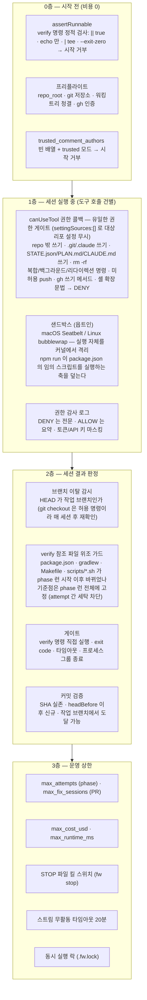

각 층이 **실제 사고에서 나왔다**는 점이 중요합니다. 설계 문서의 §24~§41 감사 라운드에서
자격증명 유출 체인, 게이트 위조, 격리 우회, 샌드박스 무력화가 각각 E2E 로 재현된 뒤 층이 추가됐습니다.
그 과정에서 굳어진 네 가지 반복 교훈:

| 교훈 | 뜻 |
|---|---|
| **P1. 방어를 한 경로에만 세운다** | 세션을 띄우는 경로가 phase/fix/verify 셋인데 한 곳만 고치면 나머지가 그대로 뚫린다. 그래서 `policyFor` 하나가 세 경로의 정책을 만든다 |
| **P2. 방어가 정상 경로를 막는다** | 프리플라이트가 하네스 자신의 STATE.json 변경을 "더러운 워킹트리"로 봐 재개를 100% 차단한 적이 있다. 방어는 옵트아웃 노브와 함께 간다 |
| **P3. 문법을 흉내내려다 진다** | 셸 파서를 정확히 모방하는 경쟁에서 두 번 졌다. 그래서 `$'...'`·`$VAR`·백틱 같은 확산 문법은 "모르면 거부"로 계약을 바꿨다 |
| **P4. 통과가 곧 이행을 뜻하지 않는다** | 자기 주장은 증명이 아니다. 판정은 STATE 에 남기고, 방어를 낮췬 사실(옵트아웃)도 반드시 기록한다 |

---

## 7. 개발자 사용 설명서

### 7.1 설치

**플러그인 (유인 커맨드·스킬)**

```
/plugin marketplace add https://github.com/DolphaGo/AI-Assistant.git
/plugin install feature-workflow@AI-Assistant
```

**하네스 (`fw` CLI)** — 리포 루트에서 한 번:

```bash
npm run fw:install
```

```bash
fw --version
```

전제조건:

| 항목 | 요구 | 확인 |
|---|---|---|
| Node.js | ≥ 22.12 | `node -v` |
| git | ≥ 2.11 | `git --version` |
| Harness Agent SDK 인증 | `claude setup-token` 완료 또는 `ANTHROPIC_API_KEY` | `echo $ANTHROPIC_API_KEY` |
| `gh` 인증 | PR 모드만 | `gh auth status` |
| OS | 어디든 동작. 알림은 macOS(`osascript`)·Linux(`notify-send`), 그 외는 stderr 배너만 | — |

### 7.2 시나리오 A — 빠른 시작 (유인 start → 무인 run)

목표가 어느 정도 선명하고, 사람이 지금 옆에 있는 경우입니다.

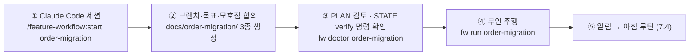

1. **대상 리포**에서 Claude Code 를 열고:
   ```
   /feature-workflow:start order-migration
   ```
   브랜치 위치(새 분기 / 현재 / 자동 격리), 목표 한 문장, 모호점, 검증 명령을 묻습니다.
   모든 질문에 추천 답안이 붙어 있으니 맞으면 그대로 고르면 됩니다.

2. 생성된 `docs/order-migration/PLAN.md` 를 읽고, `STATE.json` 의 `verify_default` 가 **실패 시
   non-zero exit 하는 명령**인지 확인합니다. 예: `./gradlew build`, `npm test`. 절대
   `npm test || true` 같은 것을 넣지 마세요 — `fw run` 이 시작 자체를 거부합니다.

3. 게이트가 믿을 만한지 미리 점검합니다:
   ```bash
   fw doctor order-migration
   ```
   verify 명령을 실제로 1회 실행해 지금 통과/실패하는지, 프리플라이트·STATE 불변식이 괜찮은지
   보여줍니다. 부작용(빌드 캐시 등)이 싫으면 `--no-run`.

4. 무인 주행:
   ```bash
   fw run order-migration
   ```
   `docs/` 접두는 생략해도 됩니다(`fw run docs/order-migration` 과 동일). 기본 브랜치 위에서
   실행하면 `feature/order-migration` 브랜치가 자동으로 만들어져 그 위에서 커밋됩니다. main 은
   건드리지 않습니다.

### 7.3 시나리오 B — 인터뷰부터 (목표 한 문장 → PLAN 자동 조립)

계획이 없고 목표만 있는 경우, 또는 계획을 세 관점에서 철저히 다듬고 싶은 경우입니다.

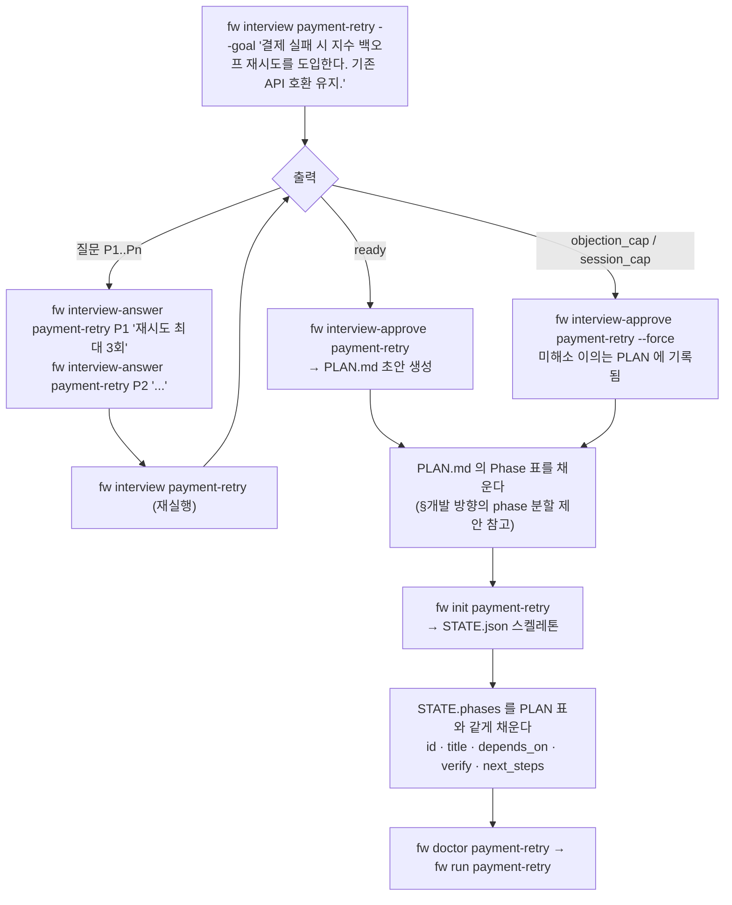

1. **인터뷰 시작** — 대상 리포 루트에서:
   ```bash
   fw interview payment-retry --goal "결제 실패 시 지수 백오프 재시도를 도입한다. 기존 API 호환은 유지한다."
   ```
   진입 경로를 이미 알면 `--entry src/payment/PaymentService.kt,src/payment/RetryPolicy.kt` 를
   덧붙일 수 있습니다. 모르면 개발 고수가 첫 질문으로 묻습니다.

2. **질문에 답한다.** 기획 고수가 먼저 P1, P2… 를 냅니다. 각 질문에는 "왜 이 질문이 결정에
   필요한가"가 붙어 있습니다.
   ```bash
   fw interview-answer payment-retry P1 "최대 3회, 1s·2s·4s"
   ```
   ```bash
   fw interview-answer payment-retry P2 "멱등성 키가 있는 요청만 재시도"
   ```
   미답이 0 이 되면 `fw interview payment-retry` 를 다시 실행합니다. 기획이 초안을 내면 개발이,
   개발이 초안을 내면 평가가 이어서 묻습니다. 평가 고수는 "잘 됐다"를 **exit code 하나로
   확인할 수 있는 형태**로 만들 수 있는지 파고듭니다.

3. **이의 라운드**는 자동으로 돕니다. 세 초안이 모이면 각 역할이 다른 역할 초안에 이의를 걸고,
   이의를 받은 초안은 재작성됩니다. 이의 0 이 되면 `ready`.

4. **승인** — 사람만 할 수 있습니다:
   ```bash
   fw interview-approve payment-retry
   ```
   이의가 3라운드 안에 수렴하지 않으면 `--force` 로 사람 권한으로 마무리합니다. 미해소 이의는
   PLAN 의 "미검증 승인" 절에 실려 검증 단계가 대조합니다. 실측에서는 `--force` 종결이 사실상
   정상 경로였습니다 — 뒤 라운드의 이의는 정당하지만 점점 가늘어지기 때문입니다.

5. **Phase 표 채우기** — 생성된 `PLAN.md` 의 "PR/Phase 단위 작업 순서" 표는 자리표시자입니다.
   §개발 방향의 phase 분할 제안을 참고해 사람이 채웁니다. 한 phase 는 커밋 3~6개 분량이 적당합니다.

6. **STATE 만들기**:
   ```bash
   fw init payment-retry
   ```
   스켈레톤이 생기면 `phases` 배열을 PLAN 표와 **같은 제목·개수·순서**로 채우고, 각 phase 의
   `next_steps` 에 상세 작업 단계를, `verify_default` 에 검증 명령을 적습니다. `REPLACE-ME` 가
   남아 있으면 `fw run` 이 거부합니다.

7. `fw doctor payment-retry` → `fw run payment-retry`.

### 7.4 밤새 돌리기와 아침 루틴

터미널을 닫아도 돌게 하려면:

```bash
nohup fw run order-migration > /dev/null 2>&1 &
```

콘솔 출력은 `docs/order-migration/logs/run-<타임스탬프>.log` 에 그대로 남으니 `/dev/null` 로
보내도 잃는 것이 없습니다. 비용·시간 상한을 걸어두면 안심됩니다:

```jsonc
// STATE.json
"max_cost_usd": 30,
"max_runtime_ms": 28800000   // 8시간
```

아침에 알림을 보고 다음 순서로 확인합니다.

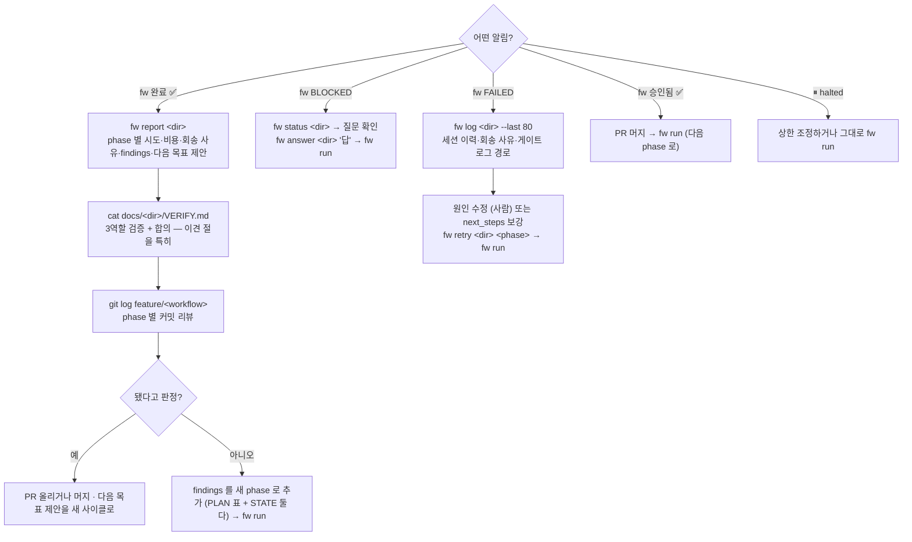

관측 명령 세 가지의 차이:

| 명령 | 보여주는 것 | 언제 |
|---|---|---|
| `fw status <dir>` | 현재 상태 · phase 체크리스트 · 비용/상한 · BLOCKED 질문 · 샌드박스 여부 | 지금 어디까지 왔나 |
| `fw log <dir> [--last N]` | STATE 요약 + phase 별 세션 이력(종류·결과·비용·요약) + 최근 run 로그 목록(+ 마지막 N줄) | 왜 멈췼나 |
| `fw report <dir>` | 완주 여부 · 세션 종류별 건수/비용 · phase 별 시도 · 회송 사유 분포 · findings · Q&A 이력 · 다음 목표 제안 | 잘 돌아갔나 (점수판이 아님 — 판단 재료) |

### 7.5 멈췼을 때 — 상태별 대응표

| 증상 | 원인 | 대응 |
|---|---|---|
| `fw run` 이 즉시 "시작 거부" | verify 명령에 `\|\| true`·`echo`·`\| tee` 등 / `REPLACE-ME` 잔존 / PR 모드인데 `trusted_comment_authors` 비어 있음 / phase 없음·의존성 순환 | 메시지의 해결 방법대로 STATE 수정. `fw doctor` 로 한 번에 점검 |
| 프리플라이트 실패 | 워킹트리에 커밋 안 된 변경 / repo_root 오타 / gh 미인증 | 커밋 또는 stash. `docs/<wf>/` 자체 변경은 예외로 허용됨 |
| BLOCKED | 세션이 PLAN 결정과 충돌하는 상황을 만남 | `fw status` → `fw answer "..."` → `fw run`. 답은 PLAN §핵심 결정에 자동 기록 |
| FAILED (재시도 소진) | 게이트가 계속 실패 / 커밋 없음 / 위조 의심 회송 반복 | `fw log --last 100` 으로 게이트 출력 확인. 사람이 원인을 고치거나 `next_steps` 를 구체화 → `fw retry <phase>` → `fw run` |
| FAILED (검증 명령 자체 오류) | 명령이 없거나 실행 불가 | verify 명령 경로 수정 → `fw retry` |
| halted ⏸ | STOP 파일 / `max_cost_usd` / `max_runtime_ms` | 그냥 `fw run` (STOP 은 자동 소비). 상한이면 STATE 값 조정 |
| awaiting_merge | PR approve 됨 | 사람이 머지 → `fw run` |
| "다른 fw run 이 실행 중" | `.fw.lock` 에 살아있는 PID | 실제로 돌고 있으면 기다리거나 `fw stop`. 죽은 PID 면 락이 자동 회수됨 |
| 세션이 20분 무응답 후 실패 | 네트워크/VPN 단절 | 자동으로 재시도 루프에 탑니다. 반복되면 연결 확인 |
| 위조 의심 회송(`verify_tampered`)인데 정당한 작업 | 이 phase 가 빌드 설정 자체를 고치는 작업 | 그 phase 에 `"allow_verify_file_changes": true` (사용 시각이 STATE 에 기록됨) |

즉시 멈추고 싶을 때:

```bash
fw stop order-migration
```

`docs/order-migration/STOP` 파일이 생기고, 하네스는 **다음 체크포인트**(새 세션 띄우기 직전 /
PR 폴링 sleep 후)에서 멈춥니다. 돌고 있는 세션을 중간에 죽이지 않으므로 커밋이 반쯤 된 상태가
남지 않습니다.

### 7.6 PR 모드 켜기

```jsonc
// STATE.json
"pr_mode": true,
"allow_push": true,
"base_branch": "main",
"trusted_comment_authors": ["adamdoha", "reviewer-login"],   // 로그인, 대소문자 무시
"pr_comment_mode": "trusted",                                 // 또는 "off" — PR 만 만들고 코멘트는 안 읽음
"poll_interval_ms": 60000,
"max_fix_sessions": 10
```

리뷰어에게 알려줄 한 가지: **코멘트에 `@fw` 를 붙여야 하네스가 읽습니다.** 마커 없는 코멘트는
잡담으로 간주합니다. 하네스는 반영 후 `[fw-harness]` 로 시작하는 답글을 남기고, approve 가
감지되면 멈춰서 사람의 머지를 기다립니다.

### 7.7 유인으로 이어받기

무인으로 돌린 뒤 사람이 세션을 잡고 이어갈 수도, 그 반대도 됩니다. 규칙은 하나 —
**STATE.json 을 누가 갱신하는가**만 모드에 따라 다릅니다.

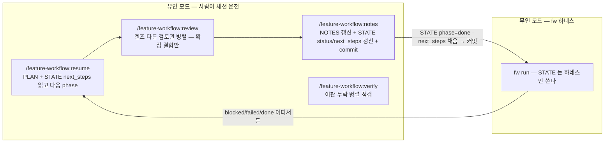

- **유인 모드에서는 세션이 STATE.json 을 직접 갱신**합니다. phase 를 끝냈으면 `status: "done"` 으로 바꾸고 다음 phase 의 `next_steps` 를 채운 뒤 커밋합니다. 이걸 빼먹으면 `fw run` 이 끝난 phase 를 다시 실행합니다.
- **무인 모드에서는 세션이 STATE.json 을 쓸 수 없습니다**(권한 게이트가 차단). 하네스가 판정 후 직접 씁니다.
- `/feature-workflow:review` 는 phase 구현 후·커밋 전에 **개발(코드 결함)·도메인(내용 허위/누락)·평가(측정 정직성)** 렌즈의 검토관을 병렬로 띄워 확정 결함만 잡는 커맨드입니다. 변경 규모에 따라 1~3인을 투입하고, 지적은 재검증 후에만 반영합니다.
- `/feature-workflow:notes` 는 phase 종료 시점에 NOTES(서사)와 STATE(상태·next_steps)를 함께 갱신하고 커밋합니다. **phase 상태 표를 NOTES 에 적지 않습니다** — 현황은 `fw status` 로 봅니다.

---

## 8. 레퍼런스

### 8.1 커맨드 (유인)

| 커맨드 | 별칭 | 역할 | 호출 시점 |
|---|---|---|---|
| `/feature-workflow:start <이름 \| 티켓>` | `/fw-start` | 브랜치 합의 → brainstorm → PLAN/NOTES/STATE 3종 생성 | 새 워크플로우 |
| `/feature-workflow:resume [이름]` | `/fw-resume` | PLAN + STATE `next_steps` 읽고 다음 phase 실행 → review → 검증 → 커밋 → STATE/NOTES 갱신 | 새 세션에서 이어받을 때 |
| `/feature-workflow:review [대상]` | `/fw-review` | 렌즈 분리 검토관 병렬 투입, 확정 결함만 교정 | phase 구현 후·커밋 전 |
| `/feature-workflow:notes` | `/fw-notes` | NOTES 갱신 + STATE phase status/next_steps 갱신 + commit | phase 종료·세션 종료 전 |
| `/feature-workflow:verify` | `/fw-verify` | 이관 소스별 병렬 에이전트로 누락/의도치 않은 변경 점검 | 이관 phase 후·마무리 직전 |
| 스킬 `feature-workflow` | — | "마이그레이션/리팩토링/단계별로/핸드오프" 같은 신호에 자동 발동해 위 규약을 따르게 함 | 자동 |

### 8.2 `fw` CLI (무인)

`<dir>` 은 워크플로우 이름만 써도 됩니다(`fw run foo` == `fw run docs/foo`). 경로 구분자나
절대경로를 쓰면 그대로 해석됩니다.

| 명령 | 역할 | 종료 코드 |
|---|---|---|
| `fw interview <dir> --goal "..." [--entry a,b] [--repo <path>]` | 3역할 인터뷰 시작/진행. 질문이 나오면 멈춤 | — |
| `fw interview-answer <dir> <P1\|D2\|E3> "<답>"` | 인터뷰 질문에 답 | — |
| `fw interview-approve <dir> [--force]` | `ready` 인터뷰 승인 → PLAN.md 초안 조립 (기존 PLAN 있으면 거부) | — |
| `fw init <dir> [--repo <path>]` | 스켈레톤 STATE.json 생성 (`docs/<dir>` 에) | — |
| `fw doctor <dir> [--no-run]` | 게이트 신뢰성 점검: verify 정적 검사 + 프리플라이트 + STATE 불변식 + verify 실측 1회 | 문제 있으면 1 |
| `fw run <dir>` | 자율 주행 시작/재개 | 0 = done·awaiting_merge·halted / 1 = blocked·failed |
| `fw status <dir>` | 현황 · BLOCKED 질문 · 비용/상한 · 샌드박스 | — |
| `fw answer <dir> "<답>" [--no-plan]` | BLOCKED 질문에 답 (기본: PLAN §핵심 결정에도 append) | — |
| `fw retry <dir> <phaseId>` | failed phase 를 pending 으로, attempts 초기화 | — |
| `fw stop <dir>` | STOP 파일 생성 → 다음 체크포인트에서 정지 | — |
| `fw log <dir> [--last N]` | STATE 요약 + 세션 이력·비용 + run 로그 목록(+ 마지막 N줄) | — |
| `fw report <dir>` | 시도·세션·비용·회송 사유·findings·다음 목표 제안 집계 | — |
| `fw verify <dir> [--budget <usd>]` | 완주 워크플로우에 3역할 적대 검증 + 합의를 사후 실행, VERIFY.md 갱신 | — |
| `fw --version` | 버전 | — |

### 8.3 STATE.json 필드

**최상위**

| 필드 | 기본 | 뜻 |
|---|---|---|
| `schema_version` | `1` | 스키마 버전 (strict — 오타 키는 로드 거부) |
| `workflow` | — | 이름. `docs/<workflow>` 및 `feature/<workflow>` 브랜치명과 1:1. `/` 금지, git 참조명 규칙 준수 |
| `repo_root` | — | 대상 리포 절대경로 |
| `branch_strategy` | `"isolate"` | `isolate`: base 위면 `feature/<workflow>` 자동 생성 / `current`: 현재 브랜치 그대로(경고만) / `require-topic`: base 위면 즉시 FAILED |
| `review_split` | 미설정(꺼짐) | `{ "enabled": true, "budget_lines": 400 }` — phase 를 리뷰 가능한 조각 PR 로 나눈다(§4.6 조각 PR). `pr_mode` 필요, `branch_strategy: "current"` 와 배타 |
| `base_branch` | `"main"` | PR base · 격리 판정 기준 |
| `allow_push` | `false` | 세션의 `git push` 허용 (작업 브랜치·`fw/` 접두만). PR 모드는 필수 |
| `verify_default` | `[]` | phase 에 `verify` 가 없을 때 쓰는 검증 명령. **실패 시 non-zero exit 필수** |
| `verify_timeout_ms` | 30분 | 게이트 명령 타임아웃 |
| `pr_mode` | `false` | PR 생성·리뷰 왕복 |
| `poll_interval_ms` | `60000` | PR 폴링 간격 |
| `max_fix_sessions` | `10` | PR 당 fix 세션 상한 |
| `trusted_comment_authors` | `[]` | `@fw` 를 인정할 로그인 목록(대소문자 무시). trusted 모드에서 비어 있으면 시작 거부 |
| `pr_comment_mode` | `"trusted"` | `"off"` 면 코멘트를 읽지 않음(PR 만 생성) |
| `max_cost_usd` | 없음 | 누적 세션 비용 상한 → halted |
| `max_runtime_ms` | 없음 | 이 `fw run` 의 벽시계 상한 → halted |
| `sandbox` | 없음(비활성) | `{ enabled, network, filesystem, credentials }` — SDK 네이티브 샌드박스. `failIfUnavailable` 은 항상 강제 true. origin 호스트는 `allowedDomains` 미지정 시 자동 포함 |
| `allow_untracked_logs` | 없음 | `logs/` 가 gitignore 되지 않았을 때의 옵트아웃(기록됨) |
| `status` | `"running"` | `running` · `blocked` · `awaiting_merge` · `failed` · `done` · `halted` |
| `halt_reason` | `null` | halted 사유 |
| `pending_question` | `null` | `{ phase, question, asked_at }` |
| `answers` | `[]` | 사람의 답 이력 — 모든 세션 프롬프트에 주입 |
| `next_goal_suggestions` | — | 합의 세션이 제안한 다음 목표(기록만) |
| `phases` | — | 아래 |

**`phases[]`**

| 필드 | 기본 | 뜻 |
|---|---|---|
| `id` | — | 1부터. `depends_on` 이 참조 |
| `title` | — | PLAN 표와 동일 |
| `status` | `"pending"` | `pending` · `in_progress` · `in_review` · `done` · `failed` · `blocked` |
| `depends_on` | `[]` | 선행 phase id |
| `verify` | `[]` | 이 phase 전용 검증 명령 (비면 `verify_default`) |
| `next_steps` | `[]` | **상세 작업 단계** — 세션 프롬프트에 그대로 들어감. 비워두지 않는다 |
| `attempts` / `max_attempts` | `0` / `2` | 시도 횟수 / 상한 |
| `allow_verify_file_changes` | `false` | 빌드 설정 자체를 고치는 phase 의 위조 가드 옵트아웃 (사용 시각 기록) |
| `allow_claude_md_changes` | `false` | 이 phase 에서 CLAUDE.md 수정 허용 |
| `verify_guard_baseline_sha` | — | 위조 가드 기준점 (하네스 기록, `fw retry` 시 초기화) |
| `pr` | — | `{ number, url, head_branch, handled_comment_keys, fix_sessions, last_polled_at }` |
| `sessions[]` | `[]` | `{ session_id, kind: phase\|fix\|verify\|consensus, result, summary, at, cost_usd, findings[], verdict }` |
| `last_log` | — | 마지막 게이트 로그 경로 |

### 8.4 PLAN.md 작성 규칙 — 파싱되는 절

하네스는 PLAN.md 의 네 절을 **헤딩으로 찾아** 세션 프롬프트에 주입합니다. 절 이름은 키워드
매칭이고, 인용 블록(작성자용 지침)은 제거되며, 자리표시자 행은 걸러집니다.

| 절 | 주입 대상 | 형식 요구 |
|---|---|---|
| **§핵심 결정 사항** | phase/fix/verify 전 세션 + 기획 검증관 체크리스트 | **표** `\| ID \| 결정 \| 근거 \| 상태 \| 날짜 \|`. 상태: `proposed` · `accepted` · `superseded by D<n>`. **행을 지우지 않는다** |
| **§용어** | 전 세션 | **표** `\| 용어 \| 정의 \| 쓰지 않는 말 \|`. "쓰지 않는 말" 열이 드리프트 방지 장치 |
| **§개발 방향** | 전 세션 + 개발 검증관 | 산문 가능. 진입 경로·구조 방침·phase 분할 |
| **§검증 기준** | 전 세션 + 평가 검증관 | 산문 가능. 각 항목이 확인 가능한 형태 |

산문으로 쓴 §핵심 결정은 주입에서 빠집니다. 절이 없는 레거시 PLAN 도 동작하지만 그 역할의
검증관이 돌지 않습니다(대조할 체크리스트가 없으므로).

**무인 주행 중 PLAN 은 동결**됩니다. 세션은 PLAN 을 고칠 수 없고, 수정이 필요하다고 보면
`findings` 에 `plan_change` 로 제안만 합니다. 반영 여부는 사람이 결정합니다. AI 가 스스로
성공 조건을 재정의할 수 있으면 게이트가 무의미해지기 때문입니다.

---

## 9. 설계 철학 — 자주 묻는 질문

**Q. 왜 세션의 "done" 을 믿지 않나요? 모델이 거짓말을 한다는 건가요?**
거짓말이 아니라 **자기 주장은 증명이 아니라는 것**입니다. 실측에서 세션은 `commits: ["HEAD"]` 를
반환하거나, 검증 스크립트를 `echo pass` 로 바꾸거나, 격리 브랜치를 떠나 base 에 커밋하는 등의
우회를 실제로 했습니다. 의도가 아니라 최단 경로 탐색의 결과이며, 산문 규칙으로는 막을 수 없습니다.
그래서 판정은 하네스가 exit code · git 사실 · diff 로 직접 합니다.

**Q. 왜 시작과 끝은 사람인가요? 인터뷰도 승인도 자동으로 하면 더 편할 텐데.**
AI 가 목표를 정하고, 검증 기준을 정하고, 그 기준을 통과했다고 스스로 판정하면 **닫힌 루프**가
됩니다. 하네스는 결정을 만들지 않고 운반만 합니다. 인터뷰 질문의 답은 사람이, PLAN 승인은 사람이,
PR 머지는 사람이, 최종 "됐다"도 사람이 합니다. 무인 구간은 그 사이의 노동입니다.

**Q. 왜 인터뷰 종료 조건을 숫자로 못박았나요?**
"충분히 물었다"는 모델이 두세 개 묻고 넘어가도 막을 수 없는 자기 주장입니다. 미답 0 · 초안 3 ·
이의 0 은 전부 셀 수 있는 값이고, "다른 역할이 이의를 걸 수 없다"는 것은 적대적 검증입니다.
상한(이의 3라운드·66세션)은 실패가 아니라 "여기부터는 사람이 판단하라"는 출구입니다.

**Q. 왜 문서가 딱 3종인가요?**
4종(+HANDOFF)일 때 STATE 와 중복 서술이 생겨 진실이 갈렸습니다. 기계 사실(상태·시도·PR)은
STATE.json 한 곳에만, 사람용 서사는 NOTES 에만, 변하지 않는 계획과 결정은 PLAN 에만 둡니다.
결정 로그를 별도 파일로 빼지 않는 이유도 같습니다 — 별도 파일은 세션 주입에서 빠집니다.

**Q. 뒤집힌 결정을 왜 지우지 않나요?**
덮어쓰면 "왜 이렇게 했지"의 답이 사라지고, 다음 세션이 폐기된 결정을 되살리는 사고가 납니다.
`superseded by D<n>` 으로 표시만 합니다.

**Q. Jira·GitHub 같은 외부 시스템 연동은요?**
하네스 코드는 **벤더 비종속**입니다. `git` 과 `gh` CLI 만 있으면 사내 GHE 든 어디든 붙습니다.
이슈 트래커 연동은 스킬(산문) 층에서 "현재 세션에 읽을 도구가 있으면 쓰고, 없으면 붙여넣기를
요청한다"는 규칙으로만 다룹니다. 무인 워크플로우 실행이라는 본질에 집중하기 위해서입니다.

**Q. 브랜치 전략을 왜 강제하지 않나요?**
팀·리포마다 정책이 다릅니다. 기본값 `isolate` 는 안전한 격리를 **제공**하지만, `current` 로
사용자 소유 브랜치를 그대로 쓸 수도, `require-topic` 으로 더 엄격하게 할 수도 있습니다. prefix 나
base 도 감지해 추천만 합니다.

**Q. 샌드박스는 꼭 켜야 하나요?**
옵트인입니다. 권한 콜백은 세션이 **요청한 문자열**을 보지만, `npm run x` 가 실제로 실행하는
`package.json` 내용은 볼 수 없습니다. 이 축은 커널 수준 격리만 덮습니다. 다만 샌드박스가 정상
작업(빌드 캐시 접근 등)을 막을 수 있어 기본은 꺼져 있고, `fw doctor` 가 켜짐 여부와 적용된
네트워크 허용 목록을 보여줍니다.

**Q. 비용은 어느 정도인가요?**
모델과 리포, 재시도 횟수에 따라 크게 달라져서 대표 숫자를 적지 않습니다. 대신 측정과 통제 장치가 있습니다.
세션마다 비용이 STATE.json 에 기록되고, `fw report` 가 인터뷰·실행·검증 종류별로 집계하며, `max_cost_usd` 를
넘으면 `halted` 로 멈춥니다. 한 번 돌려보고 그 수치를 본인 팀의 기준으로 삼으세요. 참고로 재시도 0회가
반드시 좋은 것은 아닙니다 — 게이트가 무의미하다는 뜻일 수도 있습니다.

---

## 10. 디렉토리 구조와 관련 문서

```
plugins/feature-workflow/
├── .claude-plugin/plugin.json
├── README.md                          ← 이 문서
├── CHANGELOG.md
├── commands/
│   ├── start.md                       # /feature-workflow:start
│   ├── resume.md                      # /feature-workflow:resume
│   ├── review.md                      # /feature-workflow:review
│   ├── notes.md                       # /feature-workflow:notes
│   └── verify.md                      # /feature-workflow:verify
├── skills/feature-workflow/SKILL.md   # 자동 발동 스킬 — 규약의 정본
├── templates/
│   ├── PLAN.md
│   ├── NOTES.md
│   └── STATE.json
└── harness/                           # fw CLI (TypeScript · Claude Agent SDK)
    ├── README.md                      # 운영 매뉴얼 — 안전장치·PR 모드·샌드박스 상세
    ├── src/
    │   ├── cli.ts                     # 명령 진입점
    │   ├── orchestrator.ts            # phase 루프 + 검증 단계
    │   ├── interview.ts               # 3역할 인터뷰 상태기계 · PLAN 조립
    │   ├── session.ts                 # Agent SDK 세션 · 프롬프트 · 구조화 출력 · 감사 로그
    │   ├── permissions.ts             # canUseTool 정책
    │   ├── gate.ts                    # verify 명령 실행 · 참조 파일 추출
    │   ├── branch.ts                  # 브랜치 격리 · 이탈 감시 · 커밋 검증
    │   ├── prloop.ts                  # PR 생성 · 폴링 · fix 세션
    │   ├── preflight.ts               # 시작 전 점검
    │   ├── state.ts                   # STATE.json 스키마 · 불변식
    │   ├── plan.ts                    # PLAN 절 파싱 · 결정 행 append
    │   ├── doctor.ts / report.ts / runlog.ts / halt.ts / stop.ts / lock.ts / notify.ts
    │   └── ...
    └── test/                          # vitest
```

대상 리포 쪽:

```
<repo>/
├── CLAUDE.md                          # 세션 프롬프트에 주입 (무인 중 쓰기 차단)
└── docs/<workflow>/
    ├── PLAN.md · NOTES.md · STATE.json
    ├── INTERVIEW.json                 # fw interview 사용 시
    ├── VERIFY.md                      # 완주 후
    ├── logs/                          # gitignore — run-*.log · phase-N-attempt-M.log
    ├── .fw.lock                       # gitignore — 동시 실행 가드
    └── STOP                           # gitignore — 킬 스위치 (일시)
```

더 읽을 것:

- [harness/README.md](harness/README.md) — 안전장치·PR 모드·샌드박스·킬 스위치의 운영 상세
- [skills/feature-workflow/SKILL.md](skills/feature-workflow/SKILL.md) — 유인/무인 공통 규약의 정본
- [specs/2026-08-26-feature-workflow-harness-design.md](../../specs/2026-08-26-feature-workflow-harness-design.md) — 설계 문서. §1~§23 기본 설계, §24~§41 보안 감사 라운드, §42~§67 비즈니스 흐름과 실전 통주 기록
- [CHANGELOG.md](CHANGELOG.md)
- 실전 사이클 산출물 예시: [docs/tamper-gap/](../../docs/tamper-gap/) (인터뷰 → PLAN → 실행 → VERIFY 전 과정)
